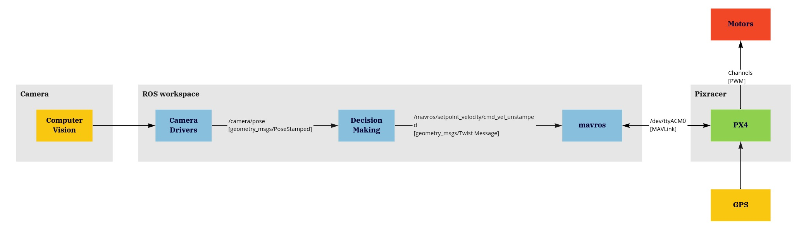

# Autonomous MAV Workflow

## Objective
Developing an autonomous MAV in order to perform the tracking of a target, identified by Arucos.

## Workflow
1. The camera should implement the "Computer Vision" algorithm, which from images can determine the relative pose of a target (Aruco) with respect to the camera.
2. The compatibility of the camera with ROS/ROS2 is ensured through a driver interface. If such interface does not already exists, there is a possibility to create a new one.
3. Develop a "Decision Making" algorithm that takes the relative pose data coming from the camera, and then takes the best decision in order to track a specific reference, sending velocity commands to the controller.
4. Mavros is an interface that takes care of ROS to PX4 data exchanges and vice-versa.
5. PX4 has been selected as autopilot firmware to be installed on the mRo Pixracer flight controller.
6. PX4 must be set to "guided mode" to allow autonomous navigation (in particular, to use velocity commands). To set the "guided mode", PX4 requires an estimate of the absolute pose of the drone. To achieve so, a GPS is required.

## Useful resources
* mavros (open source) for ROS-PX4 connection
* mavros keyboard teleoperation (our product) for handling mavros velocity messages
